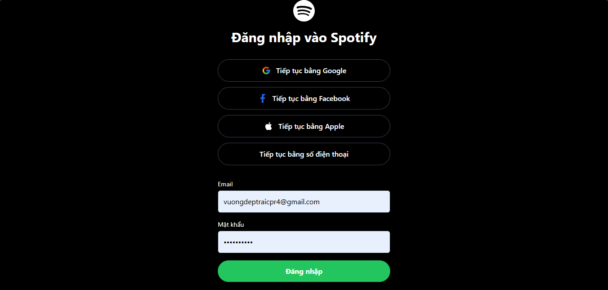
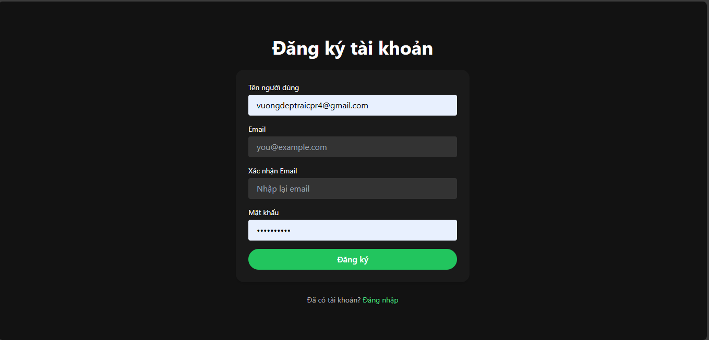
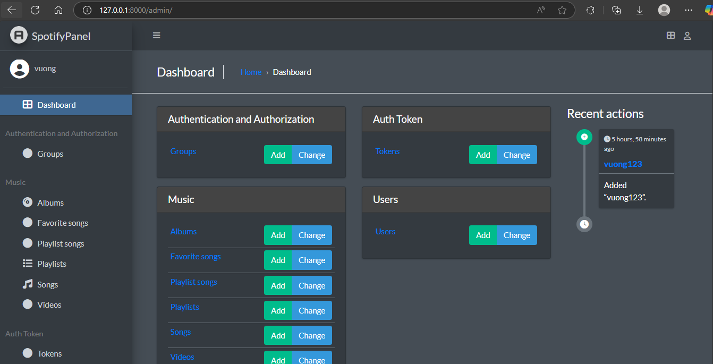
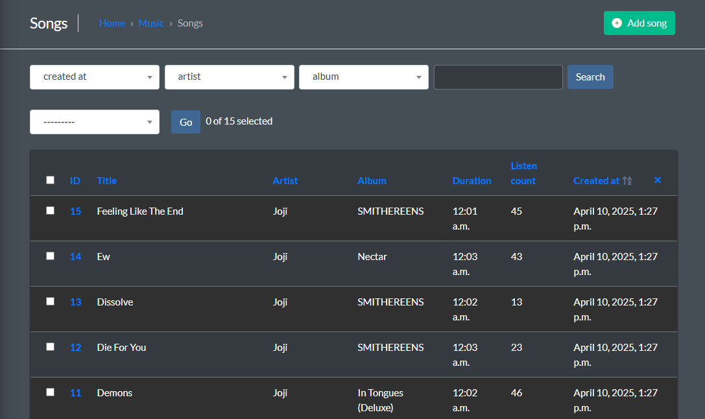
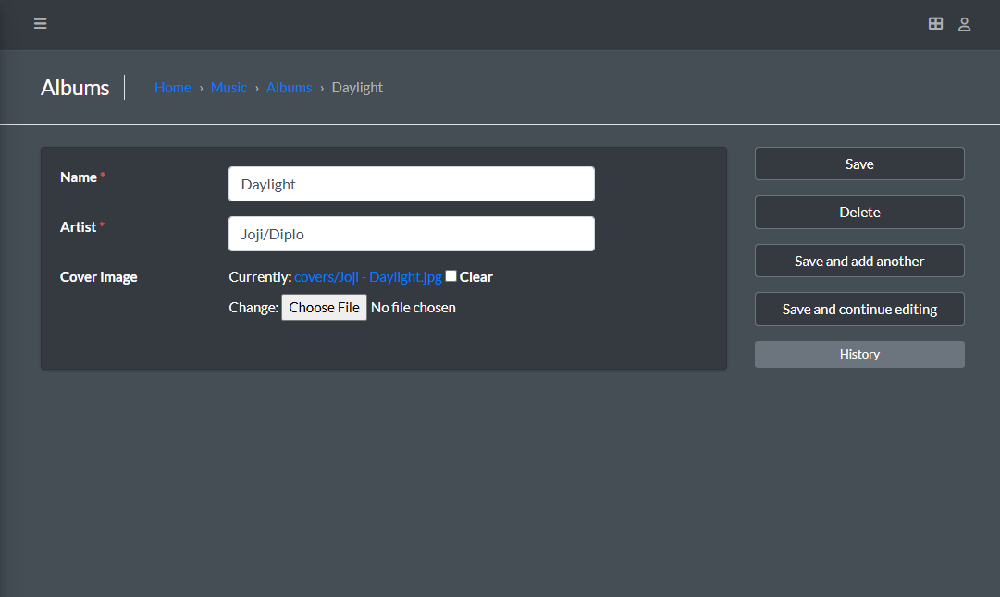

#  Spotify Clone - Music & Audio Streaming Web App

This project is a web-based music streaming platform inspired by Spotify. It includes a **Django + Django REST Framework (DRF)** backend and a **ReactJS + Vite + TailwindCSS** frontend.

##  Project Overview

The goal of this project is to provide a seamless audio streaming experience with a modern UI and RESTful API support. Key features include:
- User authentication and account management
- Song and playlist management
- Persistent global music player using Context API
- Admin dashboard for managing content
- Responsive design optimized for mobile and desktop

---

## 🛠 Technologies Used

### 🔙 Backend
- **Django 4.2** – High-level Python web framework
- **Django REST Framework (DRF)** – Build RESTful APIs with ease
- **PostgreSQL** – Powerful relational database
- **Django Jazzmin** – Modern UI theme for Django Admin

### 🔜 Frontend
- **ReactJS + Vite** – Fast frontend development with hot module replacement
- **TailwindCSS** – Utility-first CSS framework for rapid UI development
- **Context API** – Global state management (used for music player context)

---

## 📁 Project Structure

spotify-clone
├── chat
├── music
├── user
├── media/
├── frontend
├── spotifyclone
##  Getting Started

### Prerequisites

- Python 3.10+
- Node.js 18+
- PostgreSQL
- pip

---

###  Backend Setup

1. Clone the repository:
```bash
git clone https://github.com/ReOblis/spotify_clone.git
cd spotify-clone
```
2. Setup your PostgreSQL database and update settings.py:
```bash
DATABASES = {
    'default': {
        'ENGINE': 'django.db.backends.postgresql',
        'NAME': 'your_db_name',
        'USER': 'your_db_user',
        'PASSWORD': 'your_db_password',
        'HOST': 'localhost',
        'PORT': '5432',
    }
}
```
3. Run migrations and start the backend:
```bash
python manage.py migrate
python manage.py runserver
```
###  Frontend Setup
1. Navigate to the frontend directory
```bash
cd ../frontend
```
2. Install Node dependencies
```bash
npm install

```
3. Start the development server:
```bash
npm run dev

```
### Usage Notes
Ensure that both backend (localhost:8000) and frontend (localhost:5173) are running.

API requests from the frontend should be routed to the Django backend using proper CORS headers.

The music player uses Context API for persistent playback across pages.

Use the Django Admin panel to manage songs, users, and playlists.

### 🙋‍♂️ Contributors
Feel free to open issues or submit pull requests to help improve the project!

Let me know if you want me to customize this further (e.g., add example API endpoints, screenshots, or a  deploy guide).


### 🎧 Application Screenshots

This section showcases the user interface of the music streaming platform, including the main user-facing pages and the admin dashboard.

#### 🏠 Home Page (User Interface)
Here are several views from the main homepage, where users can browse, search, and play music:

| View 1 | View 2 | View 3 |
|--------|--------|--------|
|  |  |  |

| View 4 | View 5 | View 6 |
|--------|--------|--------|
|  |  |  |

#### 🔧 Admin Dashboard
These screens illustrate the administrative interface used to manage content, users, and system settings:

| Admin View 1 | Admin View 2 | Admin View 3 |
|--------------|--------------|--------------|
|  |  |  |
